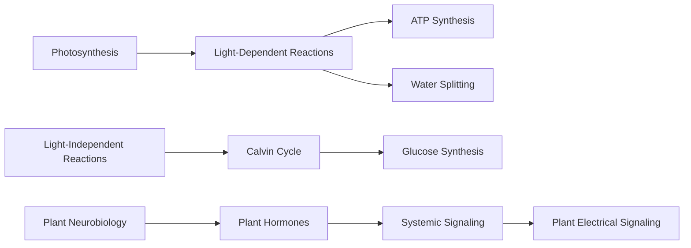

# Botany: Photosynthesis and Plant Neurobiology

## Overview

Photosynthesis is the process by which plants, algae, and some bacteria convert light energy from the sun into chemical energy in the form of organic compounds, such as glucose. This process is essential for life on Earth, as it provides the primary source of energy for nearly all organisms. Plant neurobiology, on the other hand, is the study of the neural systems and behaviors of plants, which have been found to possess complex signaling pathways and responses to their environment.

### Photosynthesis

Photosynthesis occurs in specialized organelles called chloroplasts, which contain pigments such as chlorophyll that absorb light energy. The process can be divided into two stages: the light-dependent reactions and the light-independent reactions.

#### Light-Dependent Reactions

* [[Light-Dependent Reactions]]
* Light energy is absorbed by pigments in the thylakoid membrane of chloroplasts
* Energy is transferred to a special molecule called ATP
* Water is split to produce oxygen and protons

#### Light-Independent Reactions

* [[Calvin Cycle]]
* CO2 is fixed into organic compounds using the energy from ATP and NADPH
* Glucose is synthesized from CO2 and H2O

### Plant Neurobiology

Plant neurobiology has emerged as a new field of study, which explores the neural systems and behaviors of plants. Plants have been found to possess complex signaling pathways and responses to their environment, including:

* [[Plant Hormones]]
* [[Systemic Signaling]]
* [[Plant Electrical Signaling]]

## Concept Map

## References

* [[Photosynthesis]]
* [[Plant Neurobiology]]
* [[Calvin Cycle]]
* [[Plant Hormones]]
* [[Systemic Signaling]]
* [[Plant Electrical Signaling]]