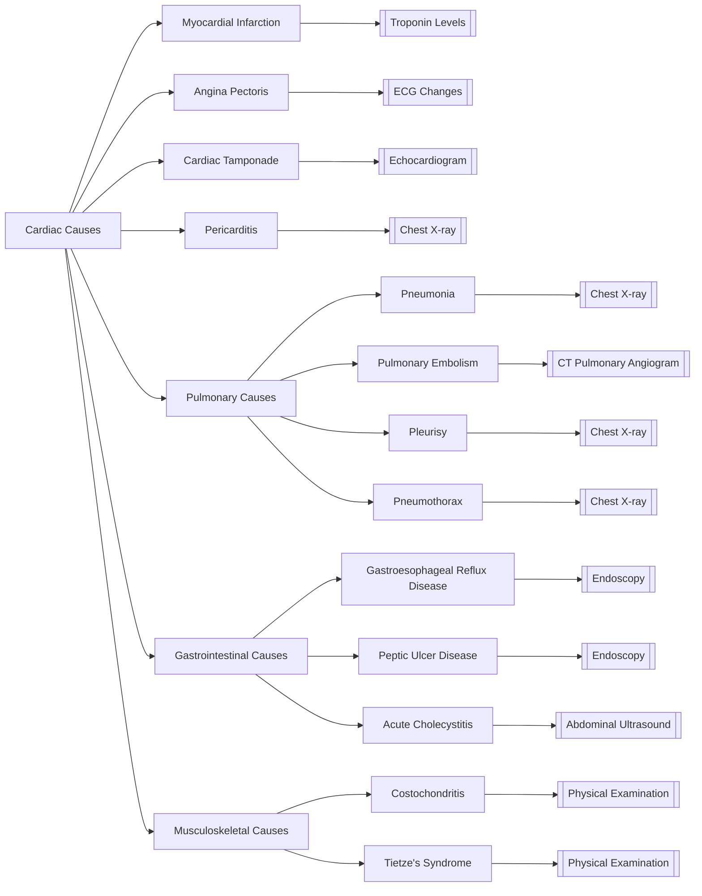

# Cardiology: Differential Diagnosis of Acute Chest Pain

## Overview

Acute chest pain is a symptom that requires immediate medical attention. The differential diagnosis of acute chest pain involves a comprehensive evaluation of various causes, including cardiac, pulmonary, gastrointestinal, musculoskeletal, and other conditions.

### Causes of Acute Chest Pain

- **Cardiac Causes**: [[Myocardial Infarction]], [[Angina Pectoris]], [[Cardiac Tamponade]], [[Pericarditis]]
- **Pulmonary Causes**: [[Pneumonia]], [[Pulmonary Embolism]], [[Pleurisy]], [[Pneumothorax]]
- **Gastrointestinal Causes**: [[Gastroesophageal Reflux Disease]], [[Peptic Ulcer Disease]], [[Acute Cholecystitis]]
- **Musculoskeletal Causes**: [[Costochondritis]], [[Tietze's Syndrome]]
- **Other Causes**: [[Panic Disorder]], [[Anxiety Disorder]], [[Costal Cartilage Fracture]]

## Concept Map

## References

- [[American Heart Association]]: Guidelines for the Management of Acute Chest Pain
- [[National Institutes of Health]]: Differential Diagnosis of Acute Chest Pain
- [[MedlinePlus]]: Acute Chest Pain

## See Also

- [[Cardiology]]
- [[Pulmonology]]
- [[Gastroenterology]]
- [[Rheumatology]]