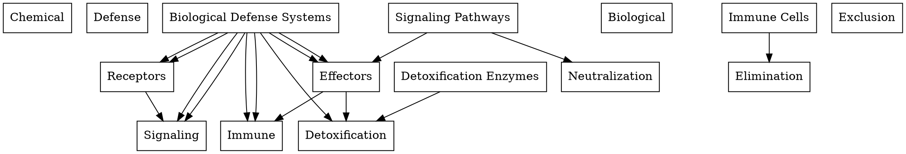

# Chemical and Biological Defense Systems

## Overview

Chemical and Biological Defense Systems (CBDS) refer to the mechanisms employed by living organisms to protect themselves against chemical and biological threats. These threats can arise from various sources, including environmental toxins, pathogens, and chemical warfare agents.

### Definition

CBDS can be categorized into two main types:

* **Chemical Defense Systems**: These systems protect against chemical threats, such as toxins and chemical warfare agents.
* **Biological Defense Systems**: These systems protect against biological threats, such as pathogens and parasites.

### Components

CBDS involve a complex interplay of various components, including:

* **Receptors**: Proteins that recognize and bind to chemical or biological threats.
* **Signaling pathways**: Molecular pathways that transmit signals from receptors to downstream effectors.
* **Effectors**: Proteins that execute the defense response, such as enzymes, transport proteins, and structural proteins.
* **Detoxification enzymes**: Enzymes that break down or neutralize chemical threats.
* **Immune cells**: Cells that recognize and eliminate biological threats.

### Mechanisms

CBDS employ various mechanisms to protect against chemical and biological threats, including:

* **Detoxification**: The breakdown or neutralization of chemical threats.
* **Exclusion**: The prevention of chemical or biological threats from entering the cell or organism.
* **Neutralization**: The inactivation of chemical or biological threats.
* **Elimination**: The removal of chemical or biological threats from the cell or organism.

## Concept Map

## See Also

* [[Toxicology]]
* [[Immunology]]
* [[Biochemistry]]
* [[Molecular Biology]]