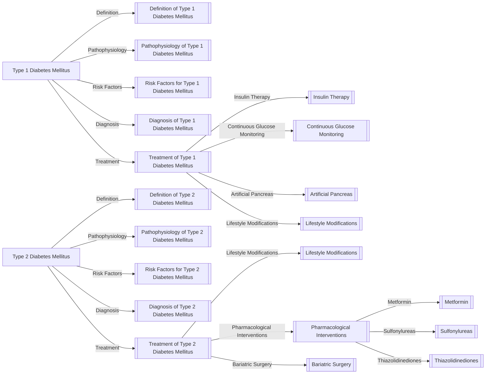

# Endocrinology: Diabetes Mellitus Type 1 and 2 Management

## Overview

Diabetes Mellitus (DM) is a group of metabolic disorders characterized by high blood sugar levels, resulting from defects in insulin secretion, insulin action, or both. Type 1 Diabetes Mellitus (T1DM) and Type 2 Diabetes Mellitus (T2DM) are the two primary forms of DM.

### Type 1 Diabetes Mellitus (T1DM)

* [[Definition of Type 1 Diabetes Mellitus]]
* [[Pathophysiology of Type 1 Diabetes Mellitus]]
* [[Risk Factors for Type 1 Diabetes Mellitus]]
* [[Diagnosis of Type 1 Diabetes Mellitus]]
* [[Treatment of Type 1 Diabetes Mellitus]]
	+ [[Insulin Therapy]]
	+ [[Continuous Glucose Monitoring]]
	+ [[Artificial Pancreas]]
	+ [[Lifestyle Modifications]]

### Type 2 Diabetes Mellitus (T2DM)

* [[Definition of Type 2 Diabetes Mellitus]]
* [[Pathophysiology of Type 2 Diabetes Mellitus]]
* [[Risk Factors for Type 2 Diabetes Mellitus]]
* [[Diagnosis of Type 2 Diabetes Mellitus]]
* [[Treatment of Type 2 Diabetes Mellitus]]
	+ [[Lifestyle Modifications]]
	+ [[Pharmacological Interventions]]
		- [[Metformin]]
		- [[Sulfonylureas]]
		- [[Thiazolidinediones]]
	+ [[Bariatric Surgery]]

## Concept Map

## References

* [[American Diabetes Association]]
* [[International Diabetes Federation]]
* [[National Institute of Diabetes and Digestive and Kidney Diseases]]