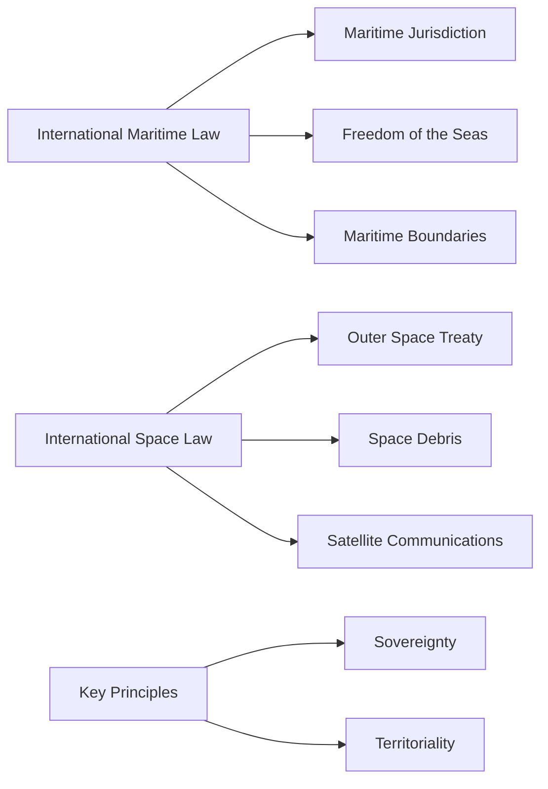

# International Maritime and Space Law

## Overview

International Maritime and Space Law is a branch of public international law that governs the use of the world's oceans and outer space. This field of law encompasses a range of topics, including:

- Maritime law, which deals with the use of the world's oceans, including shipping, navigation, and the protection of marine resources.
- Space law, which regulates the exploration and use of outer space, including satellite communications, space debris, and the protection of celestial bodies.

### Key Principles

- Sovereignty: The principle of sovereignty is a fundamental concept in international maritime and space law. States have sovereignty over their territorial waters and airspace, but this sovereignty is limited by international law.
- Territoriality: The principle of territoriality is also important in international maritime and space law. States have jurisdiction over their territory, including the seabed and subsoil beneath their territorial waters.
- Freedom of the Seas: The principle of freedom of the seas is a cornerstone of international maritime law. States have the right to navigate the world's oceans, subject to certain restrictions and regulations.
- Outer Space Treaty: The Outer Space Treaty is a foundational treaty in international space law. It establishes the principle of the peaceful use of outer space and prohibits the use of outer space for military purposes.

## Concept Map

## Related Terms

- [[Maritime Law]]
- [[Space Law]]
- [[Sovereignty]]
- [[Territoriality]]
- [[Freedom of the Seas]]
- [[Outer Space Treaty]]
- [[Space Debris]]
- [[Satellite Communications]]