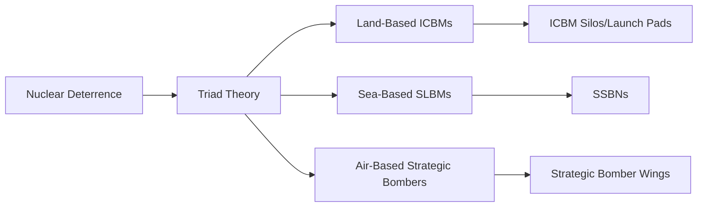

# Nuclear Deterrence and Triad Theory

## Overview

Nuclear deterrence is a military strategy that relies on the threat of nuclear weapons to prevent an adversary from taking a particular action. The triad theory is a key component of nuclear deterrence, which involves the deployment of three types of nuclear delivery systems: land-based intercontinental ballistic missiles (ICBMs), sea-based submarine-launched ballistic missiles (SLBMs), and air-based strategic bombers. This concept is based on the idea that a single point of failure in one leg of the triad would not compromise the overall nuclear deterrent capability.

### Key Components

- **Land-Based ICBMs**: [[ICBM]]s are land-based missiles that can deliver nuclear warheads over long distances. They are typically deployed in silos or launch pads and are controlled by a command and control system.
- **Sea-Based SLBMs**: [[SLBM]]s are submarine-launched missiles that can deliver nuclear warheads from beneath the ocean's surface. They are typically deployed on ballistic missile submarines (SSBNs) and are controlled by a command and control system.
- **Air-Based Strategic Bombers**: [[Strategic Bomber]]s are aircraft that can deliver nuclear warheads over long distances. They are typically deployed in a bomber wing and are controlled by a command and control system.

### Concept Map

### See Also

- [[Nuclear Warfare]]
- [[Deterrence Theory]]
- [[Strategic Nuclear Forces]]
- [[Ballistic Missile Defense]]