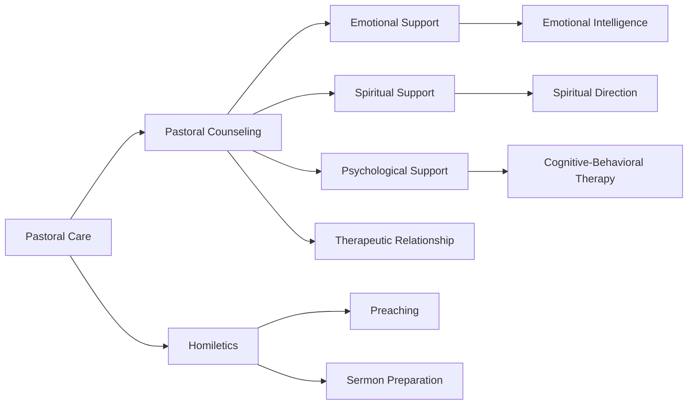

# Pastoral Counseling and Homiletics

## Overview

Pastoral counseling and homiletics are two interconnected disciplines within the field of pastoral care. Pastoral counseling involves the provision of emotional, spiritual, and psychological support to individuals, couples, and families, while homiletics focuses on the art of preaching and delivering sermons.

### Definition

* [[Pastoral care]]: A holistic approach to caring for individuals, families, and communities, addressing their physical, emotional, social, and spiritual needs.
* [[Counseling]]: A professional relationship between a trained therapist and a client, aimed at promoting personal growth, healing, and self-awareness.
* [[Homiletics]]: The art and science of preparing and delivering sermons, with the goal of inspiring, educating, and guiding congregations.

### History

* [[Patristics]]: The study of the early Christian Church Fathers, who emphasized the importance of spiritual guidance and counseling in the Christian tradition.
* [[Medieval]]: The development of monasticism and the rise of spiritual direction, which laid the groundwork for modern pastoral counseling.
* [[Modern]]: The establishment of professional counseling associations and the development of evidence-based practices in pastoral counseling.

## Concept Map

### Key Concepts

* [[Empathy]]: The ability to understand and share the feelings of others.
* [[Active listening]]: The practice of fully engaging with and responding to the words and emotions of others.
* [[Spiritual direction]]: A process of guiding individuals in their spiritual growth and development.
* [[Preaching]]: The art of delivering sermons to inspire, educate, and guide congregations.
* [[Sermon preparation]]: The process of researching, writing, and rehearsing sermons.

### Notable Figures

* [[Martin Luther]]: A key figure in the Protestant Reformation, who emphasized the importance of individual spiritual growth and development.
* [[Søren Kierkegaard]]: A Danish philosopher and theologian, who wrote extensively on the nature of faith and the importance of individual spiritual experience.
* [[Carl Rogers]]: A humanistic psychologist, who developed person-centered therapy and emphasized the importance of empathy and active listening in the therapeutic relationship.

### References

* [[American Association of Pastoral Counselors]]: A professional organization dedicated to promoting excellence in pastoral counseling.
* [[National Association of Church Business Administration]]: A professional organization that provides resources and support for church leaders, including homiletics and pastoral counseling.
* [[Journal of Pastoral Care & Counseling]]: A peer-reviewed journal that publishes research and articles on pastoral care and counseling.