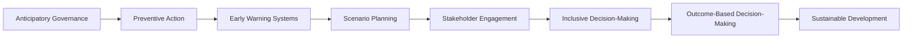

# UN Pact for the Future: Anticipatory Governance Pillars

## Overview

The United Nations Pact for the Future: Anticipatory Governance Pillars is a framework for anticipatory governance, aimed at addressing global challenges and promoting sustainable development. It was adopted by the United Nations General Assembly in [Year].

### Definition

Anticipatory governance refers to the proactive and forward-thinking approach to decision-making, focusing on identifying and mitigating potential risks and opportunities.

### Key Principles

- **Preventive Action**: Taking proactive measures to prevent crises and minimize their impact.
- **Early Warning Systems**: Establishing and utilizing early warning systems to detect potential risks and opportunities.
- **Scenario Planning**: Developing and analyzing scenarios to anticipate potential futures and inform decision-making.
- **Stakeholder Engagement**: Engaging with stakeholders to gather insights and perspectives on potential risks and opportunities.
- **Inclusive Decision-Making**: Involving diverse stakeholders in decision-making processes to ensure inclusive and representative outcomes.

## Concept Map

### Related Concepts

- [[Anticipatory Governance]]
- [[Preventive Action]]
- [[Early Warning Systems]]
- [[Scenario Planning]]
- [[Stakeholder Engagement]]
- [[Inclusive Decision-Making]]
- [[Outcome-Based Decision-Making]]
- [[Sustainable Development]]

### References

- [United Nations General Assembly. (Year). United Nations Pact for the Future: Anticipatory Governance Pillars.]
- [United Nations. (Year). Anticipatory Governance: A Framework for Action.]

### Tags

- Anticipatory Governance
- Preventive Action
- Early Warning Systems
- Scenario Planning
- Stakeholder Engagement
- Inclusive Decision-Making
- Outcome-Based Decision-Making
- Sustainable Development